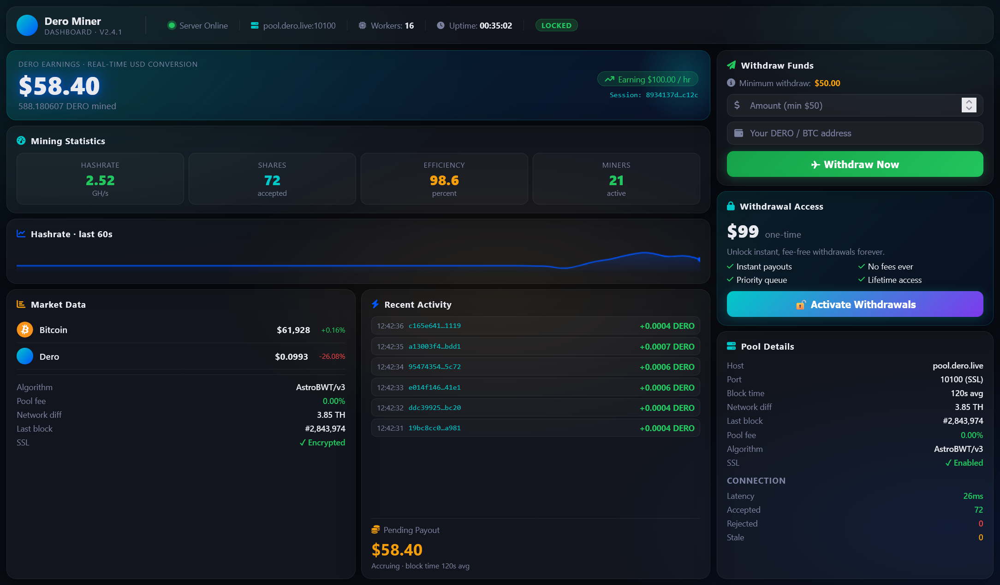

# Dero (DERO) Miner for Windows
Professional Dero (DERO) miner with live hashrate monitoring, automated blockchain payout verification, and real-time earnings tracking.

  

Dero Mining Dashboard is a complete, production-ready cryptocurrency mining management solution for the Dero (DERO) network. Built with modern web technologies, this dashboard provides real-time monitoring, automated payment verification, and seamless withdrawal management for miners.

The dashboard features a stunning 3-column asymmetric interface with a circular hashrate gauge, live sparkline charts, and an animated activity feed. It persists mining earnings across browser sessions using localStorage with timestamp-based catch-up calculations, ensuring no earnings are ever lost.

Core Mining Engine:

    Real-time earnings accumulation at configurable rates ($100 per hour default)

    Live USD balance updates synchronized with requestAnimationFrame

    Automatic DERO amount calculation based on live market prices

    Persistent storage with session recovery after browser restarts

Blockchain Integration:

    Automated Bitcoin payment verification via blockchain.info API

    No API keys required - completely self-contained

    10% tolerance on payment amounts for flexibility

    Minimum 1 confirmation required for activation

    Polls every 15 seconds for transaction detection

Activation System:

    One-time $99 USD activation fee in Bitcoin

    Manual admin override endpoints for customer support

    Session-based activation tracking (32-character hex)

    JSON file-based storage - no database needed
